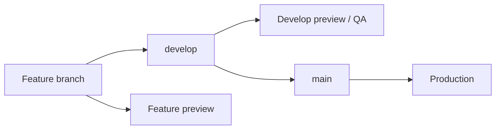

# Frontend Architecture

**Type:** Reference  
**Last updated:** 2026-06-22

Supersedes the operational parts of [FRONTEND_AUDIT_ISSUE_2.md](FRONTEND_AUDIT_ISSUE_2.md) (historical). Current status: [PROJECT_STATUS.md](PROJECT_STATUS.md). API endpoints: [API_CONTRACTS.md](API_CONTRACTS.md).

---

## Stack

| Layer | Choice |
|-------|--------|
| Framework | Next.js 16 (App Router) |
| UI | React, Tailwind CSS, shared `components/ui/` |
| HTTP | axios (`lib/api.ts`) and inline `fetch` |
| Auth | Cookie-based API auth + JWT middleware for admin paths |
| Deploy | Vercel (launch repo) |
| Monitoring | Sentry (branch `feat/sentry-monitoring`, PR #1 — not merged to RC as of 2026-06-17) |

---

## Repository and branches

| Item | Value |
|------|--------|
| Launch GitHub repo | `Digital-Builders-757/mosaic-biz-frontend-launch` |
| Integration branch | `develop` |
| Production branch | `main` |
| Branching model | Feature → `develop` → `main` — [GIT_WORKFLOW.md](GIT_WORKFLOW.md) |
| Local remote | Often `launch` or `origin` — confirm with `git remote -v` |
| Production deploy | Vercel auto-deploy on merge to `main` |

All feature work merges into **`develop` first**. Production changes ship when **`develop` is merged into `main`**. Do not open routine PRs directly into `main`.

---

## App Router layout

**App Router only** — pages under `app/`; no `pages/` directory.

| Route group | Purpose | Examples |
|-------------|---------|----------|
| `(home)` | Public marketplace, checkout, partner onboarding hub | `/`, `/products`, `/cart`, `/partners`, `/become-a-vendor` |
| `(auth)` | Login, signup, OTP, forgot password | `/login`, `/signup`, `/verify-otp` |
| `(admin)` | Admin console | `/admin`, `/admin/vendor-applications` |
| `(partner)` | Partner dashboard (business-scoped) | `/partners/[businessid]`, `/partners/dashboard` |
| `app/payment/` | Legacy/alternate payment routes | `/payment`, `/payment/success` |

### Route map (summary)

| Area | Key routes |
|------|------------|
| Homepage | `/` |
| Marketplace listings | `/products`, `/services`, `/foods`, `/vendors`, `/search` |
| Detail (live) | `/product/[id]`, `/service/[slug]`, `/vendor-profile/*` |
| Detail (mock — avoid for QA/SEO) | `/products/[productid]/[id]`, `/services/[id]/[serviceId]` |
| Vendor onboarding | `/become-a-vendor`, `/partners/*` |
| Commerce | `/cart`, `/checkout/*`, `/payment-success` |
| Auth | `/login?type=customer`, `/login?type=vendor`, `/signup` |
| Legal | `/privacy`, `/terms`, `/refund-return`, `/dispute`, trust badge pages |

---

## Environment variables

Set in `.env.local` for local dev (never commit secrets). Vercel project settings for preview/production.

| Variable | Required | Purpose |
|----------|----------|---------|
| `NEXT_PUBLIC_API_BASE_URL` | Yes | Backend API root, e.g. `https://api.mosaicbizhub.com` |
| `NEXT_PUBLIC_APP_URL` | Yes | Frontend origin, e.g. `http://localhost:3000` |
| `NEXT_PUBLIC_SENTRY_DSN` | When Sentry merged | Client error reporting |
| `SENTRY_ENVIRONMENT` | When Sentry merged | `development` / `preview` / `production` |
| `NEXT_PUBLIC_RANKED_PATH` | Optional | Override ranked API path (default `/api/ranked`) |

Default API base in [`lib/api.ts`](../lib/api.ts):

```typescript
baseURL: process.env.NEXT_PUBLIC_API_BASE_URL || "https://api.mosaicbizhub.com/"
```

**Local dev note:** Pointing `NEXT_PUBLIC_API_BASE_URL` at production from `localhost` often hits **CORS** in the browser. Use a local backend on `:3001` for full UI dev, or QA on Vercel preview where CORS is allowlisted.

---

## Deployment model



- Feature branches produce **Preview** deployments on push/PR.
- **`develop`** is the integration preview — run smoke QA here before production.
- **`main`** auto-deploys to **production** on merge (Vercel).
- Previews may require **Vercel SSO** (HTTP 401 for unauthenticated requests).
- Resolve preview URLs from the Vercel dashboard or GitHub deployment API on the launch repo.

See [GIT_WORKFLOW.md](GIT_WORKFLOW.md) for the full branching standard.

---

## API client patterns

Three patterns coexist (consolidation is a future refactor — see [ROADMAP.md](ROADMAP.md)):

1. **Inline** — `` `${process.env.NEXT_PUBLIC_API_BASE_URL}/api/...` `` in components (most common)
2. **Axios instance** — [`lib/api.ts`](../lib/api.ts) with `withCredentials: true`
3. **Domain modules** — [`lib/api/featured-products.ts`](../lib/api/featured-products.ts), `lib/api/products-admin.ts`, etc.

Prefer `lib/api/*` for new shared calls; match surrounding file conventions when editing existing pages.

---

## Authentication

| Surface | Mechanism |
|---------|-----------|
| Admin (`/admin/*`, `/signin`) | JWT in middleware — [`middleware.ts`](../middleware.ts) guards admin paths |
| Partner / customer | API cookie auth — requests use `credentials: 'include'` / `withCredentials: true` |
| Public marketplace | No auth required for browse; auth check calls may run for nav state |

Partner and customer routes pass through middleware for API cookie handling; do not assume localStorage-only auth.

---

## Styling architecture

| Surface | Token family | Guide |
|---------|--------------|-------|
| Public marketplace (PR #30) | `market-*` dusk shell | [STYLE_GUIDE.md](STYLE_GUIDE.md) |
| Marketing / auth / checkout | `brand-*` | [STYLE_GUIDE.md](STYLE_GUIDE.md) |
| Partner dashboard | `surface-*`, `dashboard-*` | [STYLE_GUIDE.md](STYLE_GUIDE.md) |
| Legal / some legacy pages | Legacy CSS / Arial | Migration pending |

Tokens defined in [`tailwind.config.js`](../tailwind.config.js) and [`app/globals.css`](../app/globals.css).

---

## Key directories

| Path | Purpose |
|------|---------|
| `app/(home)/` | Public site and marketplace |
| `app/(home)/Components/` | Shared homepage chrome (Navbar, Footer, Hero, ShopProducts) |
| `components/ui/` | shadcn-style Button, Input, Card |
| `lib/` | API helpers, fonts, utils |
| `docs/` | Internal documentation hub |

---

## Backend

API implementation, database, RLS, Stripe webhooks, and CORS allowlist are owned by **`Techware-Hut/mosaic-backend`**. This repo consumes the HTTP API only — see [API_CONTRACTS.md](API_CONTRACTS.md).
