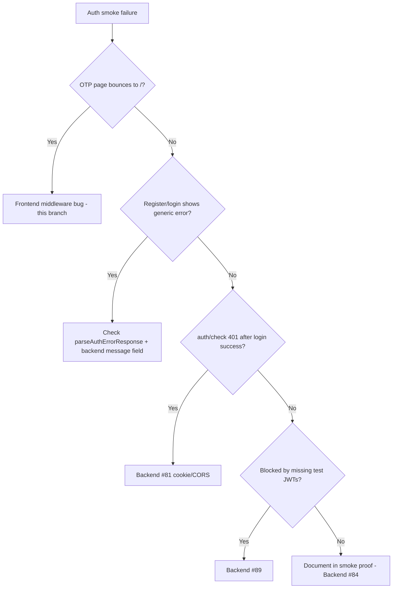

# Frontend Auth Test Account Smoke Checklist

**Branch:** `fix/frontend-auth-test-account-creation-smoke`  
**Date (UTC):** 2026-06-18  
**Repo:** `Digital-Builders-757/mosaic-biz-frontend-launch`

**Related frontend issues:** [#117](https://github.com/Digital-Builders-757/mosaic-biz-frontend-launch/issues/117) (login/register UX), [#92](https://github.com/Digital-Builders-757/mosaic-biz-frontend-launch/issues/92) (vendor consent), [#123](https://github.com/Digital-Builders-757/mosaic-biz-frontend-launch/issues/123) (credentials audit)

**Backend escalation (do not use frontend #81/#89 for auth):**

| Symptom | Backend issue |
|---------|---------------|
| Login/cookie/credentialed API failures | [Techware-Hut/mosaic-backend #81](https://github.com/Techware-Hut/mosaic-backend/issues/81) |
| Smoke proof pack / health / CORS documentation | [Techware-Hut/mosaic-backend #84](https://github.com/Techware-Hut/mosaic-backend/issues/84) |
| Blocked by missing `SMOKE_TEST_*` tokens | [Techware-Hut/mosaic-backend #89](https://github.com/Techware-Hut/mosaic-backend/issues/89) |

---

## Prerequisites

| Item | Value |
|------|-------|
| Production frontend | https://mosaic-biz-frontend-launch.vercel.app |
| API base (`NEXT_PUBLIC_API_BASE_URL`) | https://api.mosaicbizhub.com |
| Local debug logging | Set `NEXT_PUBLIC_AUTH_DEBUG=true` in `.env.local` (non-production only) |

All auth requests must use `credentials: "include"` (fetch) or `withCredentials: true` (axios). Static audit #123 confirms auth paths are wired correctly.

---

## Confirmed frontend bug (this branch)

### `/verify-otp` middleware redirect (P0)

**Before fix — live proof (2026-06-18):**

```http
GET /verify-otp?email=test%40example.com&type=customer HTTP/1.1
Host: mosaic-biz-frontend-launch.vercel.app

HTTP/1.1 307 Temporary Redirect
Location: /
```

**Root cause:** [`middleware.ts`](../middleware.ts) required `otpPending=true` on the **frontend origin**. Registration/login APIs run on `api.mosaicbizhub.com`; `Set-Cookie` from the API is not visible to Next.js middleware on `*.vercel.app`.

**Fix:** Allow `/verify-otp` when `otpPending=true` **or** a valid `email` query param is present. OTP is still validated server-side on `POST /api/users/verify-otp`.

**After fix (local middleware):** `/verify-otp?email=...` returns **200** (OTP page renders).

---

## Manual smoke matrix

Run on deployed frontend (production or preview). Use disposable test emails only. **Do not commit credentials or OTP codes.**

| # | Scenario | Steps | Pass criteria | Result |
|---|----------|-------|---------------|--------|
| 1 | Customer registration | `/signup?type=customer` → fill required fields → Register | Account created **or** exact backend validation error shown in UI (not generic failure) | ☐ |
| 2 | Customer OTP | After register → `/verify-otp?email=...` loads (not bounced to `/`) → enter OTP | Redirect to `/` or `redirect` param; no middleware 307 to `/` | ☐ |
| 3 | Customer login + session | `/login?type=customer` → sign in | `GET /api/users/auth/check` → **200** with `user.role=customer` | ☐ |
| 4 | Vendor registration | `/signup?type=vendor` → Register | Success → OTP page **or** exact validation error | ☐ |
| 5 | Vendor login + onboarding API | Login as vendor → `/partners` | `GET /api/vendor-onboarding/onboarding-data` → **200** or honest 401 redirect to login | ☐ |
| 6 | Vendor business profile | Logged-in vendor | `GET /api/business/my` → **200** (may be empty list for new account) | ☐ |
| 7 | Unauthenticated protected UX | Logged out → `/partners` or auth/check | Clean **401/403** or login redirect — **not** CORS/network error in UI | ☐ |
| 8 | Mobile viewport | `/login?type=customer`, `/signup?type=vendor` @ 390px | No horizontal overflow; forms usable | ☐ |

---

## Form submit blockers (frontend audit)

| Gate | Customer signup | Vendor signup | Vendor onboarding (stage 1) |
|------|-----------------|---------------|----------------------------|
| Required HTML fields | name, mobile, email, password, privacy checkbox | first/last, mobile, email, password, privacy checkbox | business name, contact, address, license when applicable |
| Password rules | min 6 chars, letters + digit | same | N/A |
| Confirm password | client-side mismatch check | same | N/A |
| Privacy consent | required checkbox | required checkbox | N/A |
| Terms / declaration (#92) | N/A | N/A | `acceptedTerms` + `declarationAccepted` in `validateForm()` |
| OTP | post-register redirect | post-register redirect | N/A |

---

## Network proof template (redact secrets)

```text
[Register]
POST https://api.mosaicbizhub.com/api/users/register
Status: ___
Request credentials: include
Response (redacted): { "success": ___, "message": "___" }

[Verify OTP page load]
GET https://mosaic-biz-frontend-launch.vercel.app/verify-otp?email=[REDACTED]&type=customer
Status: ___ (expect 200 after fix, was 307→/)

[Login]
POST https://api.mosaicbizhub.com/api/users/login
Status: ___

[Auth check]
GET https://api.mosaicbizhub.com/api/users/auth/check
Status: ___ (expect 200 when logged in)

[Vendor APIs]
GET /api/business/my → ___
GET /api/vendor-onboarding/onboarding-data → ___
```

---

## Pass / fail decision tree



---

## Code changes in this branch

| File | Change |
|------|--------|
| [`middleware.ts`](../middleware.ts) | Allow `/verify-otp` when `email` query present (cross-origin cookie fix) |
| [`utils/parseAuthErrorResponse.ts`](../utils/parseAuthErrorResponse.ts) | Shared safe backend error extraction |
| [`utils/authDebug.ts`](../utils/authDebug.ts) | Gated debug logging (`NEXT_PUBLIC_AUTH_DEBUG=true`, non-production) |
| [`app/(auth)/signup/page.tsx`](../app/(auth)/signup/page.tsx) | Better errors; omit null gender/minorityType; encode email in redirect |
| [`app/(auth)/login/page.tsx`](../app/(auth)/login/page.tsx) | Better errors + auth debug |
| [`app/(auth)/verify-otp/page.tsx`](../app/(auth)/verify-otp/page.tsx) | Better errors + auth debug |

---

## Debug logging (local only)

Add to `.env.local`:

```bash
NEXT_PUBLIC_AUTH_DEBUG=true
```

Restart dev server. Console emits `[auth-debug]` entries with endpoint, method, status, credentials flag, and sanitized response body (passwords/tokens redacted). **Never enable in production.**

---

## Build gate

```bash
npm run build
```

Must exit 0 before merge.
