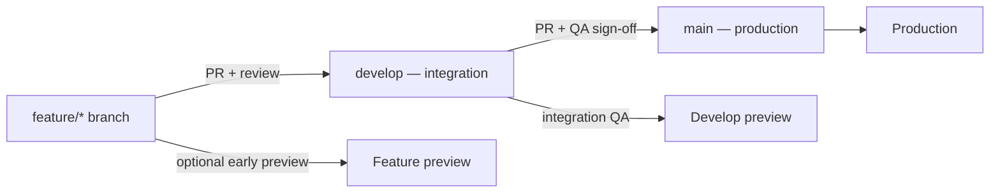
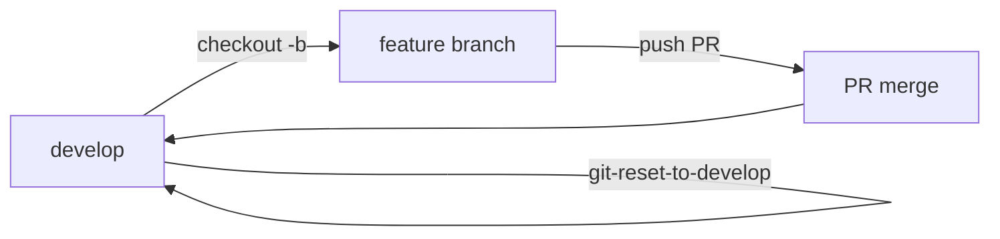

# Git Branching Workflow

**Type:** Reference (team standard)  
**Last updated:** 2026-06-22  
**Audience:** Internal team (dev, QA, release control)

This is the **canonical branching model** for `mosaic-biz-frontend`. When in doubt, follow this document.

---

## Branch roles

| Branch | Purpose | Deploys to |
|--------|---------|------------|
| `main` | Production-ready code only | **Production** (Vercel auto-deploy on merge) |
| `develop` | Integration branch — where finished work lands first | **Preview** (Vercel preview for integration QA) |
| Feature branches | Short-lived work for a single change, fix, or epic slice | **Preview** (per-branch preview on push/PR) |

**Rule:** All day-to-day development merges into `develop` first. Production changes reach users only when `develop` is merged into `main`.

---

## Standard workflow



### 1. Start from `develop`

```bash
git checkout develop
git pull launch develop
git checkout -b feat/short-description
```

Use a descriptive prefix: `feat/`, `fix/`, `polish/`, `docs/`, `chore/`, etc.

### 2. Work on the feature branch

- Push regularly; Vercel builds a **preview** for the branch/PR.
- Run `npm run build` locally before opening a PR (release gate).

### 3. Merge feature → `develop`

- Open a PR: **base = `develop`**, compare = your feature branch.
- Get review, address feedback, merge when green.
- QA integration work on the **`develop` preview**, not only the feature preview.

### 4. Merge `develop` → `main` (production)

- Open a PR: **base = `main`**, compare = `develop`.
- Requires integration QA sign-off (see [FRONTEND_SMOKE_CHECKLIST.md](FRONTEND_SMOKE_CHECKLIST.md)).
- Merge to `main` triggers **production deploy** on Vercel.

---

## What we do **not** do

| Avoid | Why |
|-------|-----|
| PR feature branches directly into `main` | Skips integration on `develop`; increases production risk |
| Long-lived work directly on `develop` or `main` | Hard to review, revert, and preview in isolation |
| Force-push shared branches (`develop`, `main`) | Breaks team history and deploy triggers |

Hotfixes that must ship immediately still follow the same path when possible: branch from `develop` (or `main` if `develop` is far ahead), merge to `develop`, then promote `develop` → `main`. Document any exception in the PR.

---

## Repository

| Item | Value |
|------|--------|
| Launch GitHub repo | `Digital-Builders-757/mosaic-biz-frontend-launch` |
| Integration branch | `develop` |
| Production branch | `main` |
| Local remote | Often `launch` — confirm with `git remote -v` |

---

## QA and release checkpoints

| Stage | Branch | Checklist |
|-------|--------|-----------|
| Feature ready | Feature → `develop` | Build passes, PR review, scoped preview smoke |
| Integration ready | `develop` | [FRONTEND_SMOKE_CHECKLIST.md](FRONTEND_SMOKE_CHECKLIST.md) on develop preview |
| Production promote | `develop` → `main` | Smoke re-run if preview URL or API contract changed |

Current release posture: [PROJECT_STATUS.md](PROJECT_STATUS.md)

---

## Legacy note

Older docs and QA reports may reference `sprint/frontend-release-candidate` as the integration branch. That branch was used during the initial launch sprint. **Going forward, `develop` is the integration branch** and `main` is production.

Historical PR evidence that targets the RC branch remains valid as archive; new work should target `develop`.

---

## Feature branch cycle (team default)

Every task follows the same loop:

1. **Start** on `develop` → pull → `git checkout -b feat/my-task`
2. **Work** on the feature branch; push and open PR **into `develop`**
3. **Complete** when the PR is merged (or the user confirms handoff)
4. **Reset** local repo to `develop` and pull latest
5. **Repeat** for the next task with a new feature branch



Agents follow [`.cursor/rules/start-from-develop.mdc`](../.cursor/rules/start-from-develop.mdc): reset to `develop` only at **task completion**, not after every chat turn.

## Reset to `develop` after each task

When a feature is done and integrated (or handed off via PR):

```powershell
.\scripts\git-reset-to-develop.ps1
```

If you have uncommitted work to keep:

```powershell
.\scripts\git-reset-to-develop.ps1 -Stash
git stash list
git stash pop    # when ready to resume on a new branch
```

Then start the next feature:

```powershell
git checkout -b feat/next-task
```

