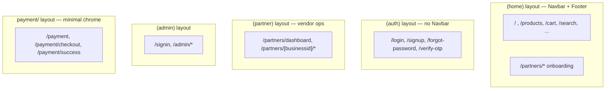

# Mobile App Navigation Audit — Epic #95 / Issue #96

**Type:** Audit / planning (no app behavior changes)  
**Branch:** `sprint/mobile-app-nav-audit-95-96`  
**Audit date:** 2026-06-18  
**Repo:** mosaic-biz-frontend  
**Epic:** [#95 — Mobile app-style navigation and UX polish](https://github.com/Digital-Builders-757/mosaic-biz-frontend-launch/issues/95)  
**Issue:** [#96 — Audit mobile routes and define bottom navigation IA](https://github.com/Digital-Builders-757/mosaic-biz-frontend-launch/issues/96)

This document audits the current frontend routing, header, hamburger menu, cart behavior, and mobile layout shell so a native-app-style bottom navigation can be implemented safely in a later batch. **No bottom nav is implemented here.**

---

## Executive summary

| Finding | Recommendation |
|---------|----------------|
| 91 routes across 4 route groups + payment | Bottom nav scoped to `(home)` public marketplace shell only |
| No `/shop`, `/discover`, `/categories`, or `/account` routes | Map recommended labels to existing routes (see IA table below) |
| Mobile nav breakpoint is `xl` (1280px) | Bottom nav should use `xl:hidden` for consistency |
| Cart lives in header + drawer today | Move primary cart access to bottom nav; simplify header in later batch |
| Discovery is search-centric | **Discover** tab → `/search` |
| Primary shop entry is products listing | **Shop** tab → `/products` |

---

## Layout shells and route groups

The app has **no root `app/layout.tsx`**. Each route group owns its own `<html>/<body>` layout.



| Route group | Layout file | Chrome | Route count |
|-------------|-------------|--------|-------------|
| `(home)` | `app/(home)/layout.tsx` | AnnouncementBar, Navbar, Footer | 61 |
| `(auth)` | `app/(auth)/layout.tsx` | Toast only | 4 |
| `(admin)` | `app/(admin)/layout.tsx` + `app/(admin)/admin/layout.tsx` | Toast; client admin auth check | 14 |
| `(partner)` | `app/(partner)/layout.tsx` | Toast; no site Footer | 11 |
| `payment/` | `app/payment/layout.tsx` | Minimal gray wrapper | 3 |

**Total:** 91 `page.tsx` routes, 7 layout files.

**Important:** `/partners/*` is split across two groups — vendor **onboarding** uses `(home)` (full site chrome); vendor **operational dashboard** uses `(partner)` (separate shell).

---

## Current route map

### Public consumer paths (bottom-nav scope)

| Area | Routes | Notes |
|------|--------|-------|
| **Home** | `/` | Homepage: `BrowseByCategory`, `CulturalDiscoveryCollections`, `HomeSearchSection` |
| **Shop / marketplace** | `/products`, `/foods`, `/services`, `/vendors`, `/search` | No `/shop`, `/marketplace`, `/categories`, or `/discover` |
| **Product / service detail** | `/product/[id]`, `/service/[slug]`, `/vendor-profile/product-vendor/[businessId]`, `/vendor-profile/service-vendor/[serviceId]`, `/vendor-profile/food-vendor/[foodId]` | Live detail pages |
| **Legacy / mock detail** | `/products/[productid]`, `/products/[productid]/[id]`, `/services/[id]`, `/services/[id]/[serviceId]` | Alternate paths; prefer live routes for new nav links |
| **Cart / checkout** | `/cart`, `/checkout`, `/checkout/address`, `/checkout/payment`, `/checkout/buy-now`, `/payment-success` | Cart is public; checkout is a flow |
| **Customer account** | `/customer/order`, `/customer/bookings` | No `/account` page |
| **Auth** | `/login?type=customer`, `/login?type=vendor`, `/signup?type=customer`, `/signup?type=vendor`, `/forgot-password`, `/verify-otp` | `(auth)` group — no site Navbar |
| **Vendor marketing** | `/become-a-vendor`, `/refer-a-vendor` | Onboarding entry points |
| **Vendor registration** | `/partners`, `/partners/business/new`, `/partners/business/payment`, `/partners/tier-selection`, `/partners/tier-selection/checkout`, `/partners/tier-selection/success`, `/partners/business-profile`, `/partners/products`, `/partners/services`, `/partners/foods`, `/partners/add-product`, `/partners/add-service`, `/partners/add-food`, `/partners/payout-setup`, `/partners/connect/return`, `/partners/final-review`, `/partners/business/[businessid]/setup` | Under `(home)` — keeps Navbar |
| **Vendor dashboard** | `/partners/dashboard`, `/partners/[businessid]`, `/partners/[businessid]/inventory/*`, `/partners/[businessid]/orders`, `/partners/[businessid]/bookings`, `/partners/[businessid]/finance`, `/partners/[businessid]/my-account` | `(partner)` group — separate layout |
| **Static / legal** | `/about`, `/contact`, `/how-to-use-this-app`, `/faq`, `/terms`, `/privacy`, `/dispute`, `/refund-return`, `/consumer/terms`, `/consumer/trustbadge`, `/vendor/terms`, `/vendor/trustbadge` | Linked from LEARN / MORE in nav |

### Routes that do NOT exist (do not invent for bottom nav)

| Implied label | Status |
|---------------|--------|
| `/shop` | Does not exist — use `/products` |
| `/discover` | Does not exist — use `/search` |
| `/categories` | Does not exist — categories fetched via API on listing pages |
| `/account` | Does not exist — use role-specific paths |
| `/register` | Does not exist — use `/signup` |
| `/marketplace` | Does not exist — marketing copy only |

### Stub / unused routes (do not link from nav)

| Route | Status |
|-------|--------|
| `/dashboard` | Stub placeholder — not linked from nav |
| `/foods/shop/[id]` | Stub page — do not promise full shop UX |

### Out of bottom-nav scope

| Area | Routes | Reason |
|------|--------|--------|
| Admin | `/signin`, `/admin/*` | Separate layout and auth |
| Auth pages | `/login`, `/signup`, `/forgot-password`, `/verify-otp` | No site chrome |
| Partner ops dashboard | `/partners/dashboard`, `/partners/[businessid]/*` | `(partner)` layout — different UX |
| Payment legacy | `/payment/*` | Minimal layout, no Navbar |
| Middleware-only | `/customer/*` matched but not JWT-blocked | API cookie auth may be cross-origin |

---

## Full route inventory by group

### `(home)` — 61 routes

**Browse & discovery**

- `/`
- `/products`, `/product/[id]`, `/products/[productid]`, `/products/[productid]/[id]`
- `/foods`, `/foods/resturant/[id]`, `/foods/shop/[id]`
- `/services`, `/services/[id]`, `/services/[id]/[serviceId]`, `/service/[slug]`
- `/vendors`, `/vendors/[vendor_id]`
- `/search`
- `/vendor-profile/food-vendor/[foodId]`, `/vendor-profile/product-vendor/[businessId]`, `/vendor-profile/service-vendor/[serviceId]`

**Cart & checkout**

- `/cart`
- `/checkout`, `/checkout/address`, `/checkout/payment`, `/checkout/buy-now`
- `/payment-success`

**Customer**

- `/customer/order`, `/customer/bookings`
- `/dashboard` (stub)

**Vendor marketing & static**

- `/become-a-vendor`, `/refer-a-vendor`
- `/about`, `/contact`, `/how-to-use-this-app`, `/faq`
- `/terms`, `/privacy`, `/dispute`, `/refund-return`
- `/consumer/terms`, `/consumer/trustbadge`, `/vendor/terms`, `/vendor/trustbadge`

**Vendor onboarding (`/partners/*` under home shell)**

- `/partners`, `/partners/business/new`, `/partners/business/payment`
- `/partners/tier-selection`, `/partners/tier-selection/checkout`, `/partners/tier-selection/success`
- `/partners/business-profile`, `/partners/products`, `/partners/services`, `/partners/foods`
- `/partners/add-product`, `/partners/add-service`, `/partners/add-food`
- `/partners/payout-setup`, `/partners/connect/return`, `/partners/final-review`
- `/partners/business/[businessid]/setup`, `/partners/services/[serviceId]`

### `(auth)` — 4 routes

- `/login`, `/signup`, `/forgot-password`, `/verify-otp`

### `(admin)` — 14 routes

- `/signin`
- `/admin`, `/admin/businesses`, `/admin/categories-management`, `/admin/category-requests`
- `/admin/cms`, `/admin/orders`, `/admin/products`, `/admin/subscription`
- `/admin/subscription/new`, `/admin/subscription/[id]/edit`
- `/admin/testimonials`, `/admin/users`
- `/admin/vendor-applications`, `/admin/vendor-applications/[id]`

### `(partner)` — 11 routes

- `/partners/dashboard`
- `/partners/[businessid]`, `/partners/[businessid]/bookings`, `/partners/[businessid]/finance`
- `/partners/[businessid]/inventory`, `/partners/[businessid]/inventory/add-product`, `/partners/[businessid]/inventory/add-service`
- `/partners/[businessid]/inventory/edit/[id]`, `/partners/[businessid]/inventory/edit/[id]/add-variant`
- `/partners/[businessid]/inventory/edit/[id]/[variantId]`, `/partners/[businessid]/inventory/edit-service/[serviceId]`
- `/partners/[businessid]/my-account`, `/partners/[businessid]/orders`

### `payment/` — 3 routes

- `/payment`, `/payment/checkout`, `/payment/success`

---

## Current navigation architecture

### Source files

| File | Role |
|------|------|
| `app/(home)/Components/Navbar.tsx` | Header orchestrator |
| `app/(home)/Components/nav/navConfig.ts` | Single source of truth for nav links |
| `app/(home)/Components/nav/DesktopNav.tsx` | Horizontal nav — `xl+` only |
| `app/(home)/Components/nav/HeaderActions.tsx` | Cart + account/login — desktop vs compact |
| `app/(home)/Components/nav/CartButton.tsx` | Cart icon link → `/cart` |
| `app/(home)/Components/nav/MobileNavDrawer.tsx` | Right slide-in drawer — `< xl` |
| `app/(home)/Components/AnnouncementBar.tsx` | Fixed top promo bar → `/products` |
| `app/(home)/Components/Footer.tsx` | Footer link columns |
| `hooks/useCartCount.ts` | Guest localStorage + server cart count |

### Viewport behavior

| Viewport | Header | Navigation |
|----------|--------|------------|
| **≥1280px (`xl`)** | Full desktop nav: HOME, SHOP, BECOME A VENDOR, LEARN, MORE + login/cart | Inline `DesktopNav` + `HeaderActions` desktop variant |
| **<1280px** | Compact: logo, cart, account, hamburger | All primary links in `MobileNavDrawer` |

### Nav link config (`navConfig.ts`)

| Section | Links |
|---------|-------|
| HOME | `/` |
| SHOP | `/products`, `/foods`, `/services`, `/vendors`, `/search` |
| BECOME A VENDOR | `/become-a-vendor` |
| LEARN | `/about`, `/contact`, `/how-to-use-this-app`, `/faq` |
| MORE | FAQ, terms, privacy, dispute, refunds, consumer/vendor terms, trust badges |
| LOGIN | `/login?type=customer`, `/login?type=vendor` |
| SEARCH CTA | `/search` ("Search marketplace") |

### Mobile drawer structure (today)

1. **Search** — primary CTA → `/search`
2. **Home** → `/`
3. **Shop** — Products, Foods, Services, Vendors, Search
4. **Become a Vendor** — button CTA
5. **Learn** — About, Contact, How to Use, FAQ
6. **More** — all legal/trust links
7. **Account** — Cart, login buttons or avatar + orders/bookings/dashboard + logout

### Cart behavior

- **Header:** `CartButton` is `<Link href="/cart">` with badge from `useCartCount`
- **Drawer:** duplicate Cart link in Account section (logged-in and logged-out)
- **Count source:** guest `localStorage` (`guest_cart`) + server fetch for logged-in users
- **Events:** `cart:update`, `cart:server:update` for badge refresh
- **No modal/drawer cart** — always navigates to `/cart` page

### No bottom navigation today

There is no site-wide bottom tab bar. Closest fixed-bottom UI:

- `MobileStickyActionBar.tsx` — product/vendor detail CTAs (`lg:hidden`, `z-40`, `pb-24 lg:pb-0`)
- `MobileFilterDrawer.tsx` — listing filter bottom sheet (`lg:hidden`)

### Layout shell and CSS

**`app/(home)/layout.tsx`:**

```
AnnouncementBar (fixed, z-60)
Navbar (#site-header, fixed, z-50)
{children}
ToastContainer
Footer
```

**CSS variables (`globals.css`, class `with-fixed-header` on `<html>`):**

- `--header-h: 64px` — updated live via ResizeObserver in Navbar
- `--announcement-h: 0px` — `2.25rem` when announcement visible
- `body { padding-top: calc(var(--header-h) + var(--announcement-h)); }`

**Tailwind breakpoints (defaults, no custom overrides):**

| Prefix | Min width |
|--------|-----------|
| `sm` | 640px |
| `md` | 768px |
| `lg` | 1024px |
| `xl` | 1280px |

Nav-specific: all mobile drawer logic uses **`xl` (1280px)**. Filter drawers and sticky action bars use **`lg` (1024px)**.

---

## Recommended bottom navigation IA

Proposed 5-tab bar for **public `(home)` shell only**, visible **below `xl` (1280px)**:

| Tab label | Route target | Rationale |
|-----------|--------------|-----------|
| **Home** | `/` | Existing homepage; matches `HOME_LINK` |
| **Shop** | `/products` | Primary product listing; announcement bar and hero CTAs point here |
| **Discover** | `/search` | No `/discover` route; search is the unified discovery hub (drawer top CTA, homepage search, cultural discovery query links) |
| **Cart** | `/cart` | Existing cart page |
| **Account** | Role-aware (see auth table) | No `/account` route |

### Active-state rules (for implementation)

| Tab | Active when path matches |
|-----|--------------------------|
| Home | Exact `/` |
| Shop | `/products`, `/product/*`, `/foods`, `/foods/*`, `/services`, `/services/*`, `/service/*`, `/vendors`, `/vendors/*`, `/vendor-profile/*` |
| Discover | `/search` (including query params) |
| Cart | Exact `/cart` |
| Account | `/login`, `/signup`, `/customer/*`, `/partners/dashboard` (vendor logged-in) |

**Note:** Including all shop-family routes under Shop active state avoids tab flicker when browsing Foods/Services/Vendors from hamburger sub-links.

---

## Hamburger vs bottom nav split

### Move to bottom nav (remove from drawer primary nav)

| Item | Target |
|------|--------|
| Home | `/` |
| Shop entry | `/products` |
| Discover | `/search` |
| Cart | `/cart` |
| Account entry | Role-aware landing |

### Keep in hamburger drawer

| Section | Items |
|---------|-------|
| Shop sub-links | Foods (`/foods`), Services (`/services`), Vendors (`/vendors`) |
| Vendor CTA | Become a Vendor (`/become-a-vendor`) |
| Learn | About, Contact, How to Use, FAQ |
| More | Terms, privacy, dispute, refunds, consumer/vendor terms, trust badges |
| Account overflow (logged in) | My Orders, My Bookings, Dashboard, Logout |
| Account overflow (logged out) | Vendor login, signup links |

### Compact header (post-implementation)

| Element | Recommendation |
|---------|----------------|
| Logo | Keep — home shortcut |
| Hamburger | Keep — secondary IA |
| Cart icon | **Remove from header** once bottom nav ships; badge lives on Cart tab only (reduces clutter) |
| Account avatar | **Remove from header** or keep as shortcut — recommend removing; Account tab covers it |

---

## Auth behavior — Account / Vendor

| Auth state | Account tab target | Drawer overflow |
|------------|-------------------|-----------------|
| Guest | `/login?type=customer` | Vendor login (`/login?type=vendor`), signup links |
| Customer (logged in) | `/customer/order` | My Orders, My Bookings, Logout |
| Vendor / business_owner (logged in) | `/partners/dashboard` | Dashboard deep-links, Logout |

### Auth implementation notes

- **No unified `/account` hub** — a dedicated account landing page may be added in a future batch; for now reuse existing destinations from `MobileNavDrawer.tsx`
- **Navbar auth detection:** `localStorage.user_session === "true"` + `getLoggedInCustomer()` API check; vendors are logged in but not "customer"
- **Stale nav risk:** Navbar does not listen for `auth:login` events — nav may not refresh until page reload after login
- **Middleware** (`middleware.ts`): matcher includes `/login`, `/signup`, `/customer/*`, `/partners/*`, `/dashboard`; `/cart` and `/products` are **not** in matcher; `/customer/*` and `/partners/*` pass through without JWT block
- **Vendor onboarding** (`/partners/business/new`, etc.) stays under `(home)` shell — bottom nav will still show during onboarding (UX decision: keep visible so users can return to shop)
- **Partner operational dashboard** `(partner)` layout — **exclude bottom nav** initially; different shell with Sidebar/Topbar

### Dual vendor dashboard systems

| System | Route | Nav link today |
|--------|-------|----------------|
| Tabbed dashboard (preferred) | `/partners/dashboard` | Avatar → Dashboard (vendor) |
| Legacy per-business | `/partners/[businessid]/*` | Sidebar nav only — not in main site nav |

Account tab should target **`/partners/dashboard`** (tabbed). Legacy sidebar dashboard remains accessible via deep links only.

---

## Risks and implementation notes

1. **Fixed UI stacking** — Announcement bar + header + bottom nav + `MobileStickyActionBar` on detail pages requires coordinated spacing. Add `--bottom-nav-h` CSS variable and `padding-bottom` on body. Z-index stack: announcement `z-60`, drawer `z-55`, header `z-50`, bottom nav `z-45`, sticky bar `z-40`.

2. **Breakpoint alignment** — Nav switches at `xl` (1280px); filter drawers use `lg` (1024px). Bottom nav should use **`xl:hidden`** for consistency with existing mobile nav breakpoint.

3. **Route gaps** — `/dashboard` stub is unused; `/foods/shop/[id]` is a stub. Do not link from nav.

4. **Checkout / payment flows** — Consider hiding bottom nav on `/checkout/*` to reduce distraction during purchase flow. `/payment/*` routes have no `(home)` chrome already.

5. **Desktop unchanged** — Bottom nav component must be `xl:hidden`. No changes to `DesktopNav.tsx`.

6. **Single source of truth** — Extend `navConfig.ts` with `BOTTOM_NAV_ITEMS` array in implementation batch.

7. **Cart badge duplication** — If header cart is removed, ensure bottom nav Cart tab shows badge via existing `useCartCount` hook.

8. **Safe area insets** — Bottom nav must respect `env(safe-area-inset-bottom)` on iOS devices with home indicator.

9. **Detail page sticky bars** — `MobileStickyActionBar` uses `pb-24 lg:pb-0`; will need additional bottom padding when bottom nav is present (e.g. `pb-[calc(6rem+var(--bottom-nav-h))]`).

10. **Partner dashboard Navbar reuse** — `/partners/dashboard` imports home `Navbar` but uses `(partner)` layout without Footer. Bottom nav scope decision needed: show on tabbed dashboard or exclude all `(partner)` routes.

---

## Files likely needing changes (future batches)

| File | Change |
|------|--------|
| `app/(home)/layout.tsx` | Mount `MobileBottomNav` inside `(home)` shell |
| `app/(home)/Components/nav/MobileBottomNav.tsx` | **New** — bottom tab bar component |
| `app/(home)/Components/nav/navConfig.ts` | Add `BOTTOM_NAV_ITEMS` config |
| `app/globals.css` | `--bottom-nav-h`, body `padding-bottom`, safe-area insets |
| `app/(home)/Components/Navbar.tsx` | Simplify compact header (remove cart/account when bottom nav ships) |
| `app/(home)/Components/nav/MobileNavDrawer.tsx` | Remove duplicated Home, Shop entry, Cart, Account primary links |
| `app/(home)/Components/nav/HeaderActions.tsx` | Simplify compact variant |
| `app/(home)/Components/MobileStickyActionBar.tsx` | Adjust padding/z-index for bottom nav coexistence |
| `docs/HEADER_NAV_QA.md` | Extend QA matrix for bottom nav |

---

## QA checklist (for later implementation batches)

Cross-reference existing [`docs/HEADER_NAV_QA.md`](HEADER_NAV_QA.md) viewport matrix.

### Navigation correctness

- [ ] All 5 tabs navigate to correct routes (guest session)
- [ ] All 5 tabs navigate correctly (customer logged in)
- [ ] All 5 tabs navigate correctly (vendor logged in)
- [ ] Account tab → `/login?type=customer` when logged out
- [ ] Account tab → `/customer/order` when customer logged in
- [ ] Account tab → `/partners/dashboard` when vendor logged in

### Active state

- [ ] Home tab active on `/`
- [ ] Shop tab active on `/products`, `/product/[id]`, `/foods`, `/services`, `/vendors`
- [ ] Discover tab active on `/search` (with and without query params)
- [ ] Cart tab active on `/cart`
- [ ] Account tab active on `/customer/*`, `/login`, `/partners/dashboard`

### Cart badge

- [ ] Cart badge shows correct count on bottom nav tab
- [ ] Badge updates when item added/removed (guest localStorage)
- [ ] Badge updates when item added/removed (logged-in server cart)
- [ ] Badge shows "99+" when count exceeds 99

### Layout and responsive

- [ ] Bottom nav visible at 320px, 375px, 390px, 414px, 768px, 1024px
- [ ] Bottom nav hidden at 1280px and above
- [ ] No horizontal scroll at any mobile width with bottom nav visible
- [ ] Safe-area insets respected on iOS (home indicator clearance)
- [ ] Content not hidden behind bottom nav (body padding-bottom correct)

### Hamburger drawer

- [ ] Drawer still opens and closes correctly
- [ ] No duplicate Home link in drawer
- [ ] No duplicate Cart link in drawer (moved to bottom nav)
- [ ] Shop sub-links (Foods, Services, Vendors) still accessible in drawer
- [ ] Become a Vendor, Learn, More sections unchanged
- [ ] Account overflow (orders, bookings, logout) still in drawer

### Detail pages and sticky bars

- [ ] `MobileStickyActionBar` does not cover bottom nav on product detail pages
- [ ] `MobileStickyActionBar` does not cover bottom nav on vendor profile pages
- [ ] Bottom padding on detail pages accounts for both sticky bar and bottom nav

### Scoped exclusion

- [ ] Bottom nav absent on `/login`, `/signup`, `/forgot-password`, `/verify-otp`
- [ ] Bottom nav absent on `/admin/*`, `/signin`
- [ ] Bottom nav absent or correctly scoped on `/partners/dashboard` and `/partners/[businessid]/*`
- [ ] Bottom nav hidden or de-emphasized on `/checkout/*`

### Accessibility

- [ ] Bottom nav uses `role="navigation"` with `aria-label`
- [ ] Active tab has `aria-current="page"`
- [ ] Tab targets meet `min-h-11` (44px) tap target
- [ ] Focus order: header → content → bottom nav
- [ ] Screen reader announces tab labels and active state

### Auth edge cases

- [ ] Logout from drawer refreshes Account tab to login state
- [ ] Login from auth page returns to appropriate tab active state
- [ ] Nav refreshes after login without requiring full page reload (address stale nav risk)

---

## Related documentation

- [`docs/HEADER_NAV_QA.md`](HEADER_NAV_QA.md) — Header and mobile drawer QA (Epic #107–#111)
- [`docs/LINK_QA_AUDIT.md`](LINK_QA_AUDIT.md) — Public link and CTA audit (Epic #75)
- [`docs/ARCHITECTURE.md`](ARCHITECTURE.md) — Route groups and live vs mock detail pages
- [`docs/STYLE_GUIDE.md`](STYLE_GUIDE.md) — Glass navbar breakpoints and nav config reference
- [`app/(home)/Components/nav/navConfig.ts`](../app/(home)/Components/nav/navConfig.ts) — Single source of truth for nav links
