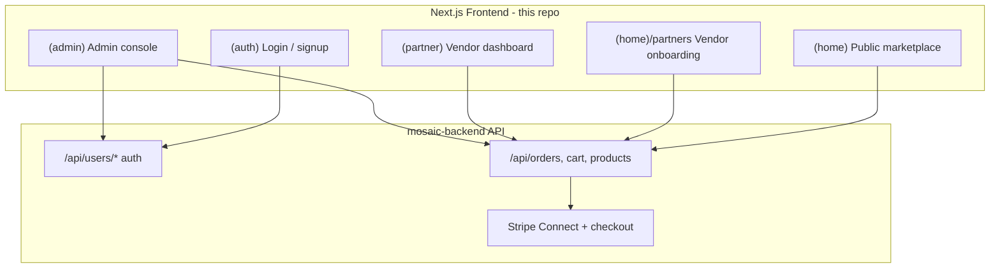
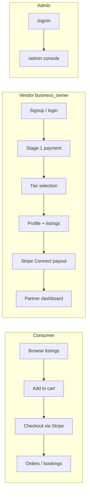
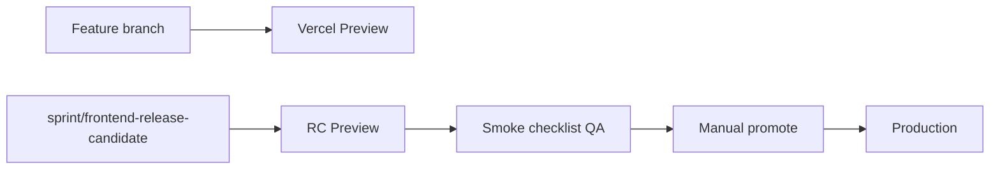

# Mosaic Biz Hub — Full Project Breakdown

**Type:** Reference  
**Audience:** New developers, PMs, and anyone onboarding to the codebase  
**Last updated:** 2026-06-19

Supplements [ARCHITECTURE.md](ARCHITECTURE.md) with a end-to-end picture of how the frontend fits together — user journeys, auth, data flow, and code organization.

---

## What This Project Is

**Mosaic Biz Hub** is the consumer-facing frontend for a B2C/B2B marketplace. It lets shoppers browse and buy **products**, **services**, and **food** from verified minority-owned vendors. Vendors onboard, subscribe to tiers, connect Stripe payouts, and manage inventory. Admins moderate the platform.

This repo is **frontend-only**. All persistence, auth cookies, Stripe webhooks, and CORS live in the separate backend: [`Techware-Hut/mosaic-backend`](https://github.com/Techware-Hut/mosaic-backend) at `https://api.mosaicbizhub.com`.

**Important:** This is **not** a Supabase/Next.js-auth-helpers stack. Roles here are **`customer`**, **`business_owner`** (vendor), and **`admin`**.

---

## High-Level System Diagram



---

## Tech Stack

| Layer | Choice | Where |
|-------|--------|-------|
| Framework | Next.js 16 App Router, React 19 | [`package.json`](../package.json) |
| Language | TypeScript 5 (strict) | [`tsconfig.json`](../tsconfig.json) |
| Styling | Tailwind CSS 3 + custom design tokens | [`tailwind.config.js`](../tailwind.config.js), [`app/globals.css`](../app/globals.css) |
| UI libs | MUI 7 (price sliders only), minimal shadcn-style primitives | [`components/ui/`](../components/ui/) |
| HTTP | axios + inline fetch, `withCredentials: true` | [`lib/api.ts`](../lib/api.ts) |
| Auth | Cookie session (API) + JWT middleware (admin hints) | [`middleware.ts`](../middleware.ts), [`utils/authUtils.ts`](../utils/authUtils.ts) |
| State | Zustand (1 store), localStorage (guest cart, UI hints), URL params (filters) | [`app/store/businessStore.ts`](../app/store/businessStore.ts) |
| Payments | Stripe Elements + Stripe Connect JS | checkout pages, [`lib/api/stripeConnect.ts`](../lib/api/stripeConnect.ts) |
| Monitoring | Sentry | [`next.config.ts`](../next.config.ts), `instrumentation*.ts` |
| Deploy | Vercel (manual production promote) | [ARCHITECTURE.md](ARCHITECTURE.md) |

**No Next.js API routes, no Server Actions, no database in this repo.**

---

## App Router Structure

Next.js **route groups** (parentheses) organize code without affecting URLs. There is **no root `app/layout.tsx`** — each group defines its own shell.

| Route group | URL examples | Purpose |
|-------------|--------------|---------|
| [`app/(home)/`](../app/(home)/) | `/`, `/products`, `/cart`, `/partners` | Public marketplace, checkout, vendor onboarding hub |
| [`app/(auth)/`](../app/(auth)/) | `/login`, `/signup`, `/verify-otp` | Authentication (minimal chrome) |
| [`app/(partner)/`](../app/(partner)/) | `/partners/[businessid]/*`, `/partners/dashboard` | Post-onboarding vendor operations |
| [`app/(admin)/`](../app/(admin)/) | `/admin/*`, `/signin` | Platform admin console |
| [`app/payment/`](../app/payment/) | `/payment/*` | Legacy/alternate payment entry |

~95 `page.tsx` files total. Legacy URLs redirect via [`next.config.ts`](../next.config.ts) (e.g. `/products/:productid/:id` → `/product/:id`).

### Public marketplace (`(home)`)

- **Browse:** `/products`, `/services`, `/foods`, `/vendors`, `/search`
- **Detail:** `/product/[id]`, `/service/[slug]`, `/vendor-profile/*`
- **Commerce:** `/cart` → `/checkout/*` → `/payment-success`
- **Customer account:** `/customer/order`, `/customer/bookings`
- **Marketing/legal:** `/about`, `/become-a-vendor`, `/faq`, `/terms`, trust badge pages
- **Shell:** [`app/(home)/layout.tsx`](../app/(home)/layout.tsx) wraps Navbar, Footer, MobileBottomNav, toasts

### Vendor onboarding vs dashboard (two surfaces)

This is a key architectural split:

| Phase | Location | Routes |
|-------|----------|--------|
| **Onboarding** (setup, tier, Stripe Connect) | `(home)/partners/*` | `/partners/business-profile`, `/partners/tier-selection`, `/partners/payout-setup`, `/partners/add-product`, `/partners/final-review` |
| **Live operations** (orders, inventory, finance) | `(partner)/partners/[businessid]/*` | `/partners/:id/inventory`, `/orders`, `/bookings`, `/finance`, `/my-account` |

Hub page [`app/(home)/partners/page.tsx`](../app/(home)/partners/page.tsx) shows onboarding progress and business list. Per-business dashboard lives under `(partner)`.

### Admin (`(admin)`)

- Login at `/signin` (not `/login`)
- Console at `/admin` with sub-routes: users, businesses, orders, products, vendor applications, categories, subscriptions, testimonials, CMS
- Client-side guard in [`app/(admin)/admin/layout.tsx`](../app/(admin)/admin/layout.tsx) calls `GET /api/users/auth/check` and requires `role === "admin"`

---

## User Journeys



---

## Authentication (End-to-End)

### Session model (dual-layer)

1. **Primary — HTTP cookies on API host**
   - Login/register/OTP POST with `credentials: 'include'`
   - Session validated via `GET /api/users/auth/check`
   - Implemented in [`utils/authUtils.ts`](../utils/authUtils.ts)

2. **Secondary — client hints in localStorage**
   - `user_session`, `user_role`, `user_gender` for navbar/UI state
   - Set by `persistClientSession()` after successful auth

3. **Legacy JWT in cookies**
   - `token` / `auth_token` read by [`middleware.ts`](../middleware.ts) via `jose` + `JWT_SECRET`
   - Some pages still send `Authorization: Bearer` from localStorage

### Auth entry points

| Flow | Page | API |
|------|------|-----|
| Customer/vendor login | [`app/(auth)/login/page.tsx`](../app/(auth)/login/page.tsx) | `POST /api/users/login` |
| Signup | [`app/(auth)/signup/page.tsx`](../app/(auth)/signup/page.tsx) | `POST /api/users/register` |
| OTP | [`app/(auth)/verify-otp/page.tsx`](../app/(auth)/verify-otp/page.tsx) | `POST /api/users/verify-otp` |
| Admin login | [`app/(admin)/signin/page.tsx`](../app/(admin)/signin/page.tsx) | `POST /api/users/login` with `role: admin` |
| Google OAuth | Login redirect | `GET /api/auth/google?role=...` |
| Logout | [`utils/logoutUser.ts`](../utils/logoutUser.ts) | `POST /api/users/logout` |

Login URLs: `/login?type=customer`, `/login?type=vendor`. Post-login redirects: customer → `/`, vendor → `/partners`, admin → `/admin`.

### Middleware behavior ([`middleware.ts`](../middleware.ts))

Matcher: `/admin/*`, `/partners/*`, `/customer/*`, `/login`, `/signup`, `/signin`, `/verify-otp`, `/dashboard`

- **`/verify-otp`:** Allows access if `otpPending` cookie OR `email` query param (cross-origin cookie workaround)
- **Logged-in on auth pages:** JWT-based role redirect (vendor signup exempt)
- **`/admin`, `/partners`, `/customer`:** Mostly **pass-through** — real auth enforced client-side + API cookies (cross-origin limitation when API is on a different domain than frontend)

### Route guards (client-side)

| Area | Guard |
|------|-------|
| Admin | [`app/(admin)/admin/layout.tsx`](../app/(admin)/admin/layout.tsx) |
| Vendor hub | [`app/(home)/partners/page.tsx`](../app/(home)/partners/page.tsx) — `isBusinessOwner()` |
| Customer pages | API 401 handling + `withCredentials` |

---

## Data & API Layer

All data flows to the external backend. Three coexisting patterns (documented in [ARCHITECTURE.md](ARCHITECTURE.md)):

1. **Inline fetch/axios in page components** (most common)
2. **Shared axios instance** — [`lib/api.ts`](../lib/api.ts):

   ```typescript
   baseURL: process.env.NEXT_PUBLIC_API_BASE_URL || "https://api.mosaicbizhub.com/"
   withCredentials: true
   ```

3. **Domain modules** under [`lib/api/`](../lib/api/):

| Module | Purpose |
|--------|---------|
| `products.ts`, `foods.ts`, `search.ts` | Public listings |
| `vendorOnboarding.ts`, `vendorStage1Api.ts` | Vendor setup |
| `stripeConnect.ts` | Payout onboarding |
| `serviceBookings.ts`, `vendorBookings.ts` | Bookings |
| `products-admin.ts` | Admin product ops |
| `routeContract.ts` | Legacy non-`/api/` path constants |

Types are frontend-only TS interfaces in [`types/`](../types/) (`business.ts`, `product.ts`, `order.ts`, etc.) mirroring backend MongoDB-style `_id` documents.

**Canonical API docs:** [API_CONTRACTS.md](API_CONTRACTS.md), [BACKEND_FRONTEND_ROUTE_CONTRACT.md](BACKEND_FRONTEND_ROUTE_CONTRACT.md)

---

## Code Organization

```
mosaic-biz-frontend/
├── app/
│   ├── (home)/          # Public site + onboarding (~52 shared components in Components/)
│   ├── (auth)/          # Auth flows
│   ├── (admin)/         # Admin console
│   ├── (partner)/       # Vendor dashboard
│   ├── payment/         # Alternate payment routes
│   ├── store/           # Zustand (businessStore)
│   └── globals.css
├── components/ui/       # Minimal Button, Input, Card (shadcn-style, rarely imported)
├── lib/                 # API clients, fonts, Sentry, Google Places
├── hooks/               # useCartCount, useListingFilters, useSubscriptionPlans
├── types/               # Shared TS models
├── utils/               # auth, cart, Stripe, S3 upload, logout
├── public/              # Static assets
└── docs/                # Internal documentation hub
```

**Design choice:** Most UI is **colocated with routes** (`app/(home)/products/components/`, `app/(partner)/partners/[businessid]/components/`) rather than a large shared component library.

### State management

- **No React Context providers** — auth sync uses window events (`auth:login`, `auth:logout`, `cart:update`)
- **Zustand:** current business context in partner dashboard ([`app/store/businessStore.ts`](../app/store/businessStore.ts))
- **Guest cart:** localStorage via [`utils/guestCart.ts`](../utils/guestCart.ts)
- **Listing filters:** URL search params via [`hooks/useListingFilters.ts`](../hooks/useListingFilters.ts)

---

## Styling System

Three visual token families in [`tailwind.config.js`](../tailwind.config.js):

| Surface | Token prefix | Used for |
|---------|--------------|----------|
| Public marketplace | `market-*` | Dusk-themed browse pages |
| Marketing / auth / checkout | `brand-*` | Navy, gold, teal brand palette |
| Partner dashboard | `surface-*`, `dashboard-*` | Cream/gold dashboard shell |

Documented in [STYLE_GUIDE.md](STYLE_GUIDE.md). Fonts loaded via [`lib/fonts.ts`](../lib/fonts.ts) (Poppins, Montserrat, Mulish).

Rich text in vendor forms uses **TipTap**. Charts use **Recharts**; maps use **d3** + Google Places.

---

## Environment & Local Dev

Create `.env.local` (never commit):

| Variable | Purpose |
|----------|---------|
| `NEXT_PUBLIC_API_BASE_URL` | Backend root (`http://localhost:3001` local) |
| `NEXT_PUBLIC_APP_URL` | Frontend origin |
| `JWT_SECRET` | Middleware JWT verification |
| `NEXT_PUBLIC_STRIPE_PUBLISHABLE_KEY` | Stripe checkout |
| `NEXT_PUBLIC_GOOGLE_MAPS_KEY` | Address/forms |
| `NEXT_PUBLIC_SENTRY_DSN` | Error monitoring |

**CORS caveat:** Calling production API from `localhost` often fails in the browser. Run backend locally on `:3001` or QA on Vercel preview.

```bash
npm install
npm run dev    # Turbopack on :3000
npm run build  # Release gate
```

---

## Deployment Model



- Launch repo: `Digital-Builders-757/mosaic-biz-frontend-launch`
- Integration branch: `sprint/frontend-release-candidate`
- Production is **not** auto-deployed from `main`
- QA checklist: [FRONTEND_SMOKE_CHECKLIST.md](FRONTEND_SMOKE_CHECKLIST.md)

---

## Key Files Quick Reference

| Concern | File |
|---------|------|
| Route protection | [`middleware.ts`](../middleware.ts) |
| API client | [`lib/api.ts`](../lib/api.ts) |
| Session helpers | [`utils/authUtils.ts`](../utils/authUtils.ts) |
| Public shell | [`app/(home)/layout.tsx`](../app/(home)/layout.tsx) |
| Navbar auth state | [`app/(home)/Components/Navbar.tsx`](../app/(home)/Components/Navbar.tsx) |
| Nav links by role | [`app/(home)/Components/nav/navConfig.ts`](../app/(home)/Components/nav/navConfig.ts) |
| Internal docs hub | [README.md](README.md) |
| Living project status | [PROJECT_STATUS.md](PROJECT_STATUS.md) |

---

## Known Architectural Quirks

1. **Dual partner surfaces** — onboarding under `(home)/partners/`, operations under `(partner)/partners/[businessid]/`
2. **Cross-origin cookies** — when API and frontend are on different domains, middleware cannot read API-set cookies; OTP and partner routes rely on query params + client-side checks
3. **Three API call patterns** coexist — prefer `lib/api/*` for new shared calls
4. **Legacy routes** — some mock/detail paths still exist; canonical paths are `/product/[id]`, `/service/[slug]`
5. **Minimal shadcn adoption** — `components/ui/` exists but most pages use inline Tailwind
6. **Backend owns everything persistent** — schema, RLS, webhooks, CORS are not in this repo

---

## Further Reading

- [ARCHITECTURE.md](ARCHITECTURE.md) — routes, env, deployment, auth
- [API_CONTRACTS.md](API_CONTRACTS.md) — endpoint reference
- [STRIPE_CONNECT_FRONTEND_FLOW.md](STRIPE_CONNECT_FRONTEND_FLOW.md) — vendor payouts
- [STYLE_GUIDE.md](STYLE_GUIDE.md) — design tokens
- [ROADMAP.md](ROADMAP.md) — planned refactors (API consolidation, styling migration)
