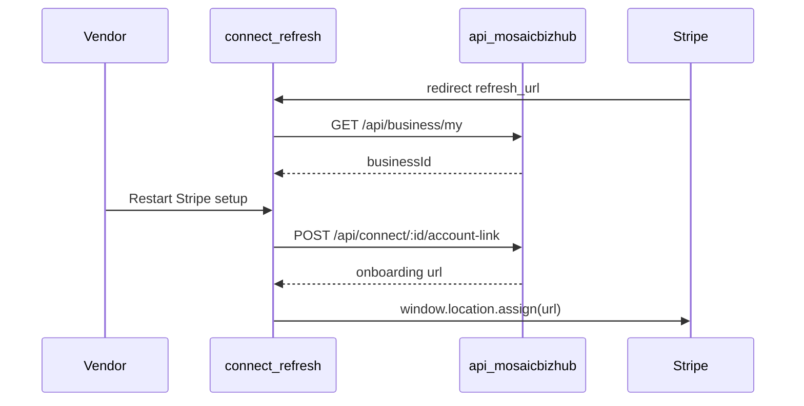

# Stripe Connect Frontend Flow

**Issue:** [#126 — Stripe Connect frontend route verification](https://github.com/Digital-Builders-757/mosaic-biz-frontend-launch/issues/126)  
**Last updated:** 2026-06-18  
**Repo:** `Digital-Builders-757/mosaic-biz-frontend-launch`

This document describes how the frontend handles Stripe Connect onboarding return and refresh URLs. Backend owns `CONNECT_RETURN_URL` and `CONNECT_REFRESH_URL`; the frontend does not read those env vars directly.

---

## Routes

| Route | Purpose | User experience |
|-------|---------|-----------------|
| [`/partners/connect/return`](../app/(home)/partners/connect/return/page.tsx) | Stripe **return_url** after onboarding step | Loading UI, then redirect to `/partners/payout-setup?refresh=1` (optional `businessId` preserved) |
| [`/partners/connect/refresh`](../app/(home)/partners/connect/refresh/page.tsx) | Stripe **refresh_url** when onboarding expires | Recovery UI with **Restart Stripe setup** CTA |
| [`/partners/payout-setup`](../app/(home)/partners/payout-setup/page.tsx) | Vendor payout onboarding hub | Status cards, Connect Stripe, refresh status |

### Backend URL coordination

| Backend env | Expected frontend path |
|-------------|------------------------|
| `CONNECT_RETURN_URL` | `…/partners/connect/return` |
| `CONNECT_REFRESH_URL` | `…/partners/connect/refresh` |

Production examples:

- `https://mosaicbizhub.com/partners/connect/return`
- `https://mosaicbizhub.com/partners/connect/refresh`

Preview / staging should use the deployed frontend origin configured in the backend.

---

## API endpoints (existing — no new contracts)

All authenticated calls use `credentials: "include"` via [`lib/api/stripeConnect.ts`](../lib/api/stripeConnect.ts).

| Method | Endpoint | Used by |
|--------|----------|---------|
| GET | `/api/business/my` | Resolve active business when `businessId` query param is missing |
| GET | `/api/connect/:businessId/status` | Payout setup status cards |
| POST | `/api/connect/:businessId/account-link` | **Restart onboarding** — returns Stripe account link URL |

### Refresh flow

---

## Manual smoke checklist

1. Visit `/partners/connect/refresh` — page loads (no 404); recovery copy visible.
2. Visit `/partners/connect/refresh?businessId=<id>` — resolves business from query when logged in.
3. Click **Restart Stripe setup** as a logged-in vendor — Network shows credentialed `POST …/api/connect/…/account-link` → redirect to Stripe.
4. Logged out or invalid business — inline error; **Back to payout setup** and **Go to dashboard** links work; page does not crash.
5. `/partners/connect/return` still redirects to payout setup with `refresh=1`.
6. `npm run build` and `npm run lint` pass.

---

## Out of scope

- Checkout, PaymentIntent, webhook, and order payment flows
- Backend Stripe account-link generation or webhook handlers
- Changes to canonical marketplace endpoint `GET /api/featured-products`
