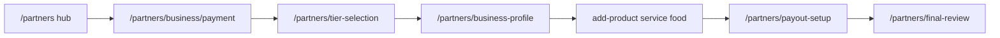

# Frontend Admin / Vendor / Customer Surface Map — As Built

**Type:** Reference (launch evidence pack)  
**Last updated:** 2026-06-23  
**Evidence source:** `app/(home)/customer/*`, `app/(home)/partners/*`, `app/(partner)/*`, `app/(admin)/*`, API grep

**Platform behavior:** [../PLATFORM_OPERATING_MODEL.md](../PLATFORM_OPERATING_MODEL.md)

---

## Customer surfaces

### Order history `/customer/order`

| Aspect | As built |
|--------|----------|
| **Renders** | User order list, cancel action |
| **APIs** | `GET /api/orders/user`; `POST /api/orders/:orderId/cancel` |
| **File** | `app/(home)/customer/order/page.tsx` |
| **Auth** | Middleware matched; credentials include |
| **Guard** | API 401 handling — Evidence Needed for redirect behavior |

### Service bookings `/customer/bookings`

| Aspect | As built |
|--------|----------|
| **Renders** | Customer booking list |
| **APIs** | `GET /api/bookings/customer` |
| **File** | `app/(home)/customer/bookings/page.tsx` |
| **Auth** | Optional Bearer from localStorage — Evidence Needed |

---

## Vendor onboarding — `(home)/partners/*`

Flow (as rendered, not business policy):

| Stage | URL | Key APIs |
|-------|-----|----------|
| Hub | `/partners` | `GET /api/vendor-onboarding/applicationId`, `GET /api/vendor-onboarding/status/:id`, `GET /api/business/my` |
| New business | `/partners/business/new` | Stage-1 draft/upload — Evidence Needed |
| Stage-1 payment | `/partners/business/payment` | `POST /api/vendor-onboarding/stage1/create-payment` |
| Tier selection | `/partners/tier-selection` | `GET /api/subscription-plans` |
| Tier checkout | `/partners/tier-selection/checkout` | `POST /api/subscriptions/create` |
| Tier success | `/partners/tier-selection/success` | Evidence Needed |
| Business profile | `/partners/business-profile` | `GET/PUT /api/vendor-onboarding/onboarding-data`, `business-profile` |
| Add listings | `/partners/add-product`, `add-service`, `add-food` | Product/service/food create APIs |
| Manage listings | `/partners/products`, `services`, `foods` | Business-scoped list/delete APIs |
| Payout setup | `/partners/payout-setup` | `GET /api/connect/:businessId/status`, `POST .../account-link` |
| Final review | `/partners/final-review` | Onboarding status + submit |
| Connect return | `/partners/connect/return` | Client redirect → `/partners/payout-setup?refresh=1` |
| Connect refresh | `/partners/connect/refresh` | Stripe Connect refresh handler |

**Guard:** `app/(home)/partners/page.tsx` — `isBusinessOwner()` or redirect `/login?type=vendor`.

---

## Partner dashboard — `(partner)/partners/*`

| Surface | URL | Key APIs |
|---------|-----|----------|
| Multi-tab dashboard | `/partners/dashboard` | Business, orders, bookings, shipping, tax tabs |
| Business overview | `/partners/[businessid]` | Business fetch, sales charts — Evidence Needed |
| Inventory | `/partners/[businessid]/inventory` | `GET /api/private/products/list`, `services/list`, `food/list` |
| Add/edit product | `.../inventory/add-product`, `edit/[id]/*` | `GET/PUT /api/product/:id`, categories |
| Add/edit service | `.../add-service`, `edit-service/[id]` | Service CRUD APIs |
| Orders | `/partners/[businessid]/orders` | `GET /api/orders/vendor` |
| Bookings | `/partners/[businessid]/bookings` | `GET /api/bookings/vendor`; actions |
| Finance | `/partners/[businessid]/finance` | `/api/connect/*` + legacy `/stripe/*` embedded dashboard |
| My account | `/partners/[businessid]/my-account` | Profile/settings — commented `/api/subscriptions/current` |

**State:** Zustand `businessStore` for current business context.

---

## Admin surfaces

### Sign-in `/signin`

| Aspect | As built |
|--------|----------|
| **API** | `POST /api/users/login` with admin role |
| **Redirect** | `/admin` on success |

### Console `/admin/*`

| URL | Purpose | Key APIs |
|-----|---------|----------|
| `/admin` | Dashboard stats | `GET /api/admin/business`; status PATCH |
| `/admin/businesses` | Business management | Shows **Approved**, **Admin active**, and **Public on marketplace** separately (`lib/admin/businessStatusDisplay.ts`); warns when active but not approved |
| `/admin/products` | Product moderation | `lib/api/products-admin.ts` → **legacy** `/admin/api/products` |
| `/admin/users` | User list | **legacy** `GET /admin/users` |
| `/admin/orders` | Order oversight | `GET /api/orders/admin` |
| `/admin/vendor-applications` | Application queue | Vendor onboarding admin APIs |
| `/admin/vendor-applications/[id]` | Review/verify/finalize | `GET/PATCH /api/vendor-onboarding/:id/*` |
| `/admin/category-requests` | Category requests | Evidence Needed |
| `/admin/categories-management` | Category CRUD | `/api/admin/categories`, `/api/admin/category/*` |
| `/admin/subscription` | Plan list | `GET /api/subscription-plans` |
| `/admin/subscription/new`, `[id]/edit` | Plan CRUD | POST/PUT `/api/subscription-plans` |
| `/admin/testimonials` | Testimonial CMS | `lib/api/testimonials.ts` |
| `/admin/cms` | Content management | `/api/cms/admin` |

**Guard:** `app/(admin)/admin/layout.tsx` — `GET /api/users/auth/check`, role must be `admin`.

---

## Legacy path usage (admin/vendor finance)

Documented in `lib/api/routeContract.ts` — **do not normalize without backend migration:**

| Frontend usage | Legacy path |
|----------------|-------------|
| Admin users page | `GET /admin/users` |
| Admin products module | `GET/PATCH /admin/api/products` |
| Partner finance page | `POST /stripe/account-session`, `/stripe/express-login-link`, `GET /stripe/account-balance`, `/stripe/last-payout` |

Live probe note (2026-06-18 in routeContract): `/api/admin/users` and `/api/stripe/account-session` return 404; legacy paths above are what the frontend actually calls.

---

## Cross-links

- [../PLATFORM_OPERATING_MODEL.md](../PLATFORM_OPERATING_MODEL.md)
- [../MARKETPLACE_VENDOR_ELIGIBILITY.md](../MARKETPLACE_VENDOR_ELIGIBILITY.md)
- [FRONTEND_ROUTE_MAP.md](FRONTEND_ROUTE_MAP.md)
- [FRONTEND_API_USAGE_INVENTORY.md](FRONTEND_API_USAGE_INVENTORY.md)
- [../STRIPE_CONNECT_FRONTEND_FLOW.md](../STRIPE_CONNECT_FRONTEND_FLOW.md)
