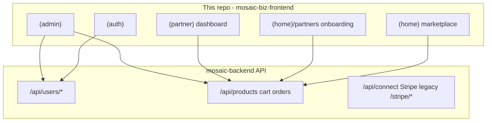

# Frontend Architecture — As Built

> **Archive note (2026-06-23):** Day-to-day architecture reference is [../ARCHITECTURE.md](../ARCHITECTURE.md) + [../PROJECT_BREAKDOWN.md](../PROJECT_BREAKDOWN.md). This file is kept as a 2026-06 launch evidence snapshot — see [../archive/README.md](../archive/README.md).

**Type:** Reference (launch evidence pack)  
**Last updated:** 2026-06-19  
**Evidence source:** Repo file read, `app/` route enumeration, `package.json`, `middleware.ts`, `lib/api.ts`

---

## System boundary

Mosaic Biz Hub frontend is a **Next.js 16 App Router** TypeScript application deployed via **Vercel**. It is **frontend-only**:

| Owned by frontend | Owned by backend (`Techware-Hut/mosaic-backend`) |
|-------------------|--------------------------------------------------|
| Pages, layouts, client UI | Persistence (MongoDB) |
| API HTTP calls with credentials | Auth session cookies (API host) |
| Stripe Elements / Connect JS (client) | Stripe webhooks, payment finalization |
| JWT middleware hints (`JWT_SECRET`) | CORS allowlist |
| localStorage guest cart / UI hints | Schema, RLS, admin data rules |

Production API base (default): `https://api.mosaicbizhub.com` via `NEXT_PUBLIC_API_BASE_URL`.



**Not in this repo:** Next.js API routes (`app/**/route.ts` = 0), Server Actions (`"use server"` = 0), Supabase, database migrations.

---

## Tech stack (as built)

| Layer | Choice | Evidence |
|-------|--------|----------|
| Framework | Next.js 16.1 App Router, React 19 | `package.json` |
| Language | TypeScript 5 strict | `tsconfig.json` |
| Styling | Tailwind CSS 3 + custom tokens | `tailwind.config.js`, `app/globals.css` |
| UI | Mostly inline Tailwind; MUI 7 (price sliders); minimal `components/ui/` | grep `@mui/material` |
| HTTP | axios (`lib/api.ts`) + inline `fetch` | ~120+ files with API calls |
| Auth | API cookie session + localStorage hints + JWT middleware | `utils/authUtils.ts`, `middleware.ts` |
| State | Zustand (1 store), localStorage, URL search params | `app/store/businessStore.ts` |
| Payments | Stripe Elements + Connect JS | checkout pages, `lib/api/stripeConnect.ts` |
| Monitoring | Sentry (`@sentry/nextjs`) | `next.config.ts`, `instrumentation.ts` |
| Deploy | Vercel; manual production promote | `docs/ARCHITECTURE.md` |

---

## App Router layout

**No root `app/layout.tsx`.** Each route group defines its own shell.

| Route group | Purpose | Layout |
|-------------|---------|--------|
| `(home)` | Public marketplace, checkout, vendor onboarding hub | `app/(home)/layout.tsx` — Navbar, Footer, MobileBottomNav |
| `(auth)` | Login, signup, OTP, forgot password | `app/(auth)/layout.tsx` |
| `(admin)` | Admin signin + console | `app/(admin)/layout.tsx`, nested `app/(admin)/admin/layout.tsx` (auth guard) |
| `(partner)` | Post-onboarding vendor dashboard | `app/(partner)/layout.tsx` |
| `payment` | Legacy payment entry | `app/payment/layout.tsx` |

**Page count:** 95 `page.tsx` files under `app/` (enumerated 2026-06-19).

### Dual vendor surfaces (key split)

| Phase | Location | Examples |
|-------|----------|----------|
| Onboarding | `(home)/partners/*` | tier selection, payout setup, add listings, final review |
| Live operations | `(partner)/partners/[businessid]/*` | inventory, orders, bookings, finance |

---

## Folder map

```
app/
  (home)/          Public site + onboarding; ~52 shared components in Components/
  (auth)/          Auth flows
  (admin)/         Admin console
  (partner)/       Vendor dashboard
  payment/         Alternate payment routes
  store/           Zustand businessStore
components/ui/     Button, Input, Card (shadcn-style, rarely imported)
lib/
  api.ts           axios instance (withCredentials: true)
  api/*            Domain API modules (15 files)
utils/             auth, cart, Stripe loader, S3 upload, logout
hooks/             useCartCount, useListingFilters, useSubscriptionPlans
types/             Frontend TS models mirroring backend _id documents
public/            Static assets
docs/              Internal documentation hub
docs/frontend/     This launch evidence pack
```

**Design choice:** UI is **colocated with routes** (`app/(home)/products/components/`, etc.) rather than a large shared library.

---

## API client patterns (three coexisting)

1. **Inline fetch/axios** in page components (most common)
2. **Shared axios instance** — `lib/api.ts`:
   ```typescript
   baseURL: process.env.NEXT_PUBLIC_API_BASE_URL || "https://api.mosaicbizhub.com/"
   withCredentials: true
   ```
3. **Domain modules** — `lib/api/*` (products, featured-products, vendorOnboarding, stripeConnect, etc.)

**Legacy non-`/api/` mounts** documented in `lib/api/routeContract.ts`: `/admin/users`, `/admin/api/products`, `/stripe/*`.

Prefer `lib/api/*` for new shared calls per `docs/ARCHITECTURE.md`.

---

## State management

| Mechanism | Location | Usage |
|-----------|----------|-------|
| Zustand | `app/store/businessStore.ts` | Current business in partner dashboard |
| localStorage | `utils/authUtils.ts`, `utils/guestCart.ts` | Session UI hints, guest cart |
| URL params | `hooks/useListingFilters.ts` | Listing filters |
| Window events | — | `auth:login`, `auth:logout`, `cart:update`, `cart:server:update` |

No React Context auth providers.

---

## Styling (as built)

| Surface | Token prefix | Guide |
|---------|--------------|-------|
| Public marketplace | `market-*` | `docs/STYLE_GUIDE.md` |
| Marketing / auth / checkout | `brand-*` | `docs/STYLE_GUIDE.md` |
| Partner dashboard | `surface-*`, `dashboard-*` | `docs/STYLE_GUIDE.md` |

Fonts: Poppins, Montserrat, Mulish via `lib/fonts.ts`.

---

## Deployment model

- Launch repo: `Digital-Builders-757/mosaic-biz-frontend-launch`
- Integration branch: `sprint/frontend-release-candidate`
- Production: **not** auto-deployed from every merge; manual promote
- Preview QA may require Vercel SSO

---

## Cross-links

- [FRONTEND_ROUTE_MAP.md](FRONTEND_ROUTE_MAP.md)
- [FRONTEND_API_USAGE_INVENTORY.md](FRONTEND_API_USAGE_INVENTORY.md)
- [FRONTEND_DOCUMENTATION_EVIDENCE_LOG.md](FRONTEND_DOCUMENTATION_EVIDENCE_LOG.md)
- [../ARCHITECTURE.md](../ARCHITECTURE.md)
- [../API_CONTRACTS.md](../API_CONTRACTS.md)
