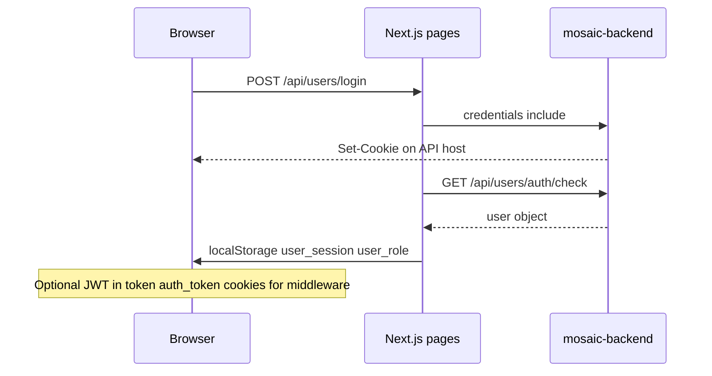

# Frontend Auth and Credentials Behavior — As Built

**Type:** Reference (launch evidence pack)  
**Last updated:** 2026-06-19  
**Evidence source:** `middleware.ts`, `utils/authUtils.ts`, `utils/logoutUser.ts`, `utils/auth.ts`, auth pages, `lib/api/stripeConnect.ts`, `lib/api/vendorOnboarding.ts`

---

## Roles (as built)

| Role | Post-login destination | Entry URL |
|------|------------------------|-----------|
| `customer` | `/` (or `?redirect=`) | `/login?type=customer` |
| `business_owner` | `/partners` | `/login?type=vendor` |
| `admin` | `/admin` | `/signin` |

This is **not** Supabase, NextAuth, or talent/client routing.

---

## Session model (three layers)

### Layer 1 — API HTTP cookies (primary)

- Login, register, OTP, logout use `credentials: 'include'` or axios `withCredentials: true`
- Session validated via `GET /api/users/auth/check`
- Cookies are set on the **API host** (`NEXT_PUBLIC_API_BASE_URL` domain)

### Layer 2 — localStorage UI hints (secondary)

Set by `persistClientSession()` in `utils/authUtils.ts`:

- `user_session` = `"true"`
- `user_role`, `user_gender`

Navbar reads these for UI state; not authoritative for security.

### Layer 3 — Legacy JWT cookies

- `middleware.ts` reads `token` or `auth_token` cookies
- Verified with `jose` + `JWT_SECRET`
- Some modules add `Authorization: Bearer` from localStorage (`stripeConnect.ts`, `vendorOnboarding.ts`)

---

## Auth flows

| Flow | Page / util | Method | Endpoint | Credentials |
|------|-------------|--------|----------|-------------|
| Customer/vendor login | `app/(auth)/login/page.tsx` | POST | `/api/users/login` | include |
| Admin login | `app/(admin)/signin/page.tsx` | POST | `/api/users/login` (role admin) | include |
| Signup | `app/(auth)/signup/page.tsx` | POST | `/api/users/register` | include |
| OTP verify | `app/(auth)/verify-otp/page.tsx` | POST | `/api/users/verify-otp` | include |
| OTP resend | `app/(auth)/verify-otp/page.tsx` | POST | `/api/users/resend-otp` | include |
| Session check | `utils/authUtils.ts` | GET | `/api/users/auth/check` | include |
| Logout | `utils/logoutUser.ts` | POST | `/api/users/logout` | include |
| Google OAuth | `app/(auth)/login/page.tsx` | redirect | `/api/auth/google?role=&redirect=` | — |
| Forgot password | `app/(auth)/forgot-password/page.tsx` | POST | `/api/users/forgot-password` | include |
| Reset password | `app/(auth)/forgot-password/page.tsx` | POST | `/api/users/reset-password` | include |

Post-login: `persistClientSession()` + role-based redirect. OTP path: login response may set `otpPending` → `/verify-otp?email=`.

---

## Middleware (`middleware.ts`)

**Matcher:** `/admin/*`, `/partners/*`, `/customer/*`, `/login`, `/signup`, `/signin`, `/verify-otp`, `/dashboard`

| Path | Behavior |
|------|----------|
| `/verify-otp` | Allow if `otpPending` cookie OR `email` query param (cross-origin workaround) |
| `/login`, `/signup`, `/signin` with JWT | Redirect by role; vendor signup exempt |
| `/admin`, `/partners`, `/customer`, `/dashboard` | **Pass-through** — auth delegated to client + API |
| Other matched paths without token | Clear cookies; redirect `/signin` (admin) or `/` |

**Cross-origin limitation:** When API and frontend are on different domains, middleware cannot read API-set cookies. Documented in middleware comments for OTP flow.

---

## Client-side route guards

| Area | File | Mechanism |
|------|------|-----------|
| Admin console | `app/(admin)/admin/layout.tsx` | `GET /api/users/auth/check` → `role === "admin"` else redirect `/signin` |
| Vendor hub | `app/(home)/partners/page.tsx` | `getAuthenticatedUser()` + `isBusinessOwner()` → redirect `/login?type=vendor` |
| Customer pages | `customer/order`, `customer/bookings` | API 401 handling + credentials |
| Public browse | Most marketplace pages | No guard; optional auth check for nav |

---

## Credentials patterns by call type

| Pattern | Where | Notes |
|---------|-------|-------|
| `credentials: 'include'` | fetch in authUtils, logout, cart, onboarding | Default for session |
| `withCredentials: true` | axios (lib/api.ts, featured-products, admin legacy) | Same as include |
| Bearer optional | stripeConnect, vendorOnboarding | Reads localStorage token if present |
| No credentials | Public category lists, minority-types, some vendor directory calls | Public read endpoints |

---

## Auth sync events

| Event | Dispatched when |
|-------|-----------------|
| `auth:login` | `persistClientSession()` |
| `auth:logout` | `clearStaleClientSession()`, `logoutUser()` |
| `cart:update` / `cart:server:update` | Cart merge / server cart changes |

No React Context auth provider.

---

## Dev-only

| Name | Purpose |
|------|---------|
| `NEXT_PUBLIC_AUTH_DEBUG` | Enables auth debug logging (`utils/authDebug.ts`) when not production |

---

## Risks / unknowns

1. **Cross-origin cookies** — preview vs local vs production domain alignment affects middleware and session reads
2. **Dual token storage** — cookies + localStorage Bearer on some paths; behavior when only one is present: **Evidence Needed**
3. **JWT middleware vs API cookie auth** — partially overlapping; not all routes use both

---

## Cross-links

- [FRONTEND_API_USAGE_INVENTORY.md](FRONTEND_API_USAGE_INVENTORY.md)
- [FRONTEND_ENVIRONMENT_VARIABLES_NAMES_ONLY.md](FRONTEND_ENVIRONMENT_VARIABLES_NAMES_ONLY.md)
- [../ARCHITECTURE.md](../ARCHITECTURE.md)
